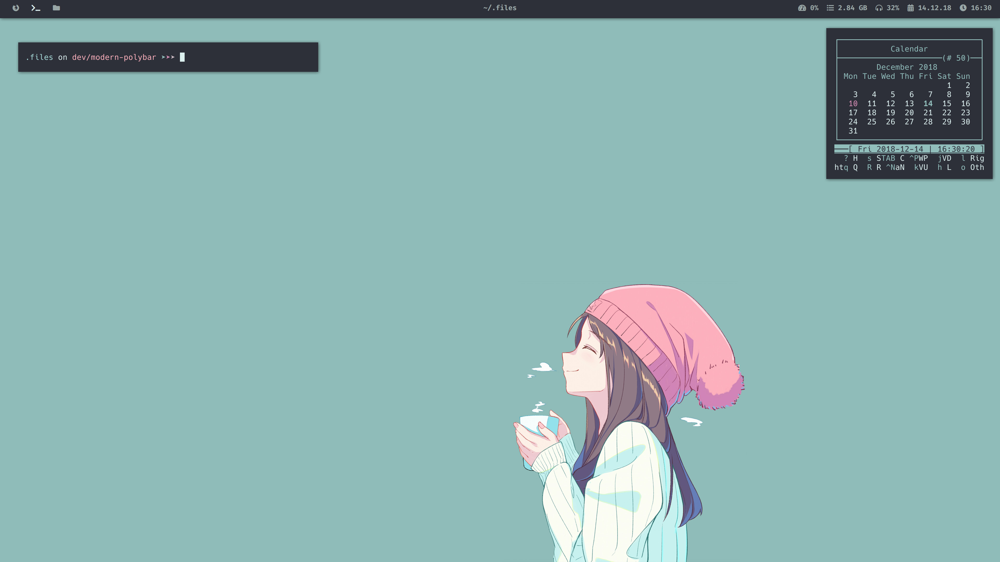

# .files

These are my dotfiles. As of 2022, my operating system of choice remains to be [Arch Linux](https://archlinux.org/). I also like [Fedora](https://getfedora.org/), but I don't use it for anything serious.

> NOTE: This readme is currently WIP and may change drastically. You are free to study and take whatever you want from these dotfiles, but avoid executing any commands that change a lot of stuff.

## History

I have been using GNU/Linux since 2012 and Arch Linux since 2017. My setup was originally [i3](https://i3wm.org/) before I switched to [bspwm](https://wiki.archlinux.org/title/Bspwm). In 2021, I added [Sway](https://swaywm.org/), although I like switching between GNOME and Plasma as well.

In 2022, I [installed Gentoo](https://wiki.gentoo.org/wiki/Handbook:AMD64/Full/Installation), but returned to Arch Linux shortly thereafter. For an explanation on why, as well as some other design choices, read the [Technical](#technical) section.

## Old Screenshots

Over time my tastes in desktop environments have changed. For nostalgic purposes, here is a collection of screenshots of my usage of GNU/Linux over time.

### 2018




### 2022

## Features

The biggest advantage my dotfiles have is a consistent setup between GTK and Qt applications across multiple window managers. Making GUIs look nice on bspwm was a major task for me, and I'm satisfied with the result. Qt applications also work well under GNOME, with a consistent theme if you're using Arc for everything.

## Usage

Since these are my personal dotfiles, they are tailored specifically to my use case.

There are 3 different ways you can use this repository.

1. Use my dotfiles as inspiration and only install what you need
2. Install all my dotfiles on your computer, a server, or something else
3. Replicate my entire Arch Linux system with minimal effort

### 1. Use my dotfiles as inspiration, and only install what you need

My dotfiles are managed with [GNU Stow](https://www.gnu.org/software/stow/manual/stow.html). Dotfiles are separated based on program, and each directory contains relevant information about those dotfiles.

In the event that you want to try out some of my dotfiles, I wrote a [Makefile](./Makefile) that makes installing and uninstalling dotfiles easy. For example, to only install vim dotfiles use:

```
make install package=vim
```

Similarly, if you want to remove the vim dotfiles you just installed, use:

```
make uninstall package=vim
```

### 2. Install all my dotfiles on your computer, server, etc.

If you want to use all the dotfiles in this repository, use:

```
make install
```

Note that if a dotfile already exists then stow won't override it, so this works best on new user accounts that don't have any dotfiles on them yet.

### 3. Replicate my entire system with minimal effort

## Technical

Throughout my journey with GNU/Linux, I learned a lot about how computer systems work, including how to use systemd, networking, package management, filesystems, configuration files, and other cool stuff. I also had to deal with a lot of edge cases when it came to different versions of software, such as certain features not working due to conflicting library dependencies.

Previously I used media keys for media keybinds. Since I now use super for those commands, keybinds should work on any machine.

## Support and contributing

If you have any questions about my dotfiles, feel free to [open an issue](https://github.com/donovanglover/dotfiles/issues). You can also [contribute](./CONTRIBUTING.md) by submitting a pull request.
